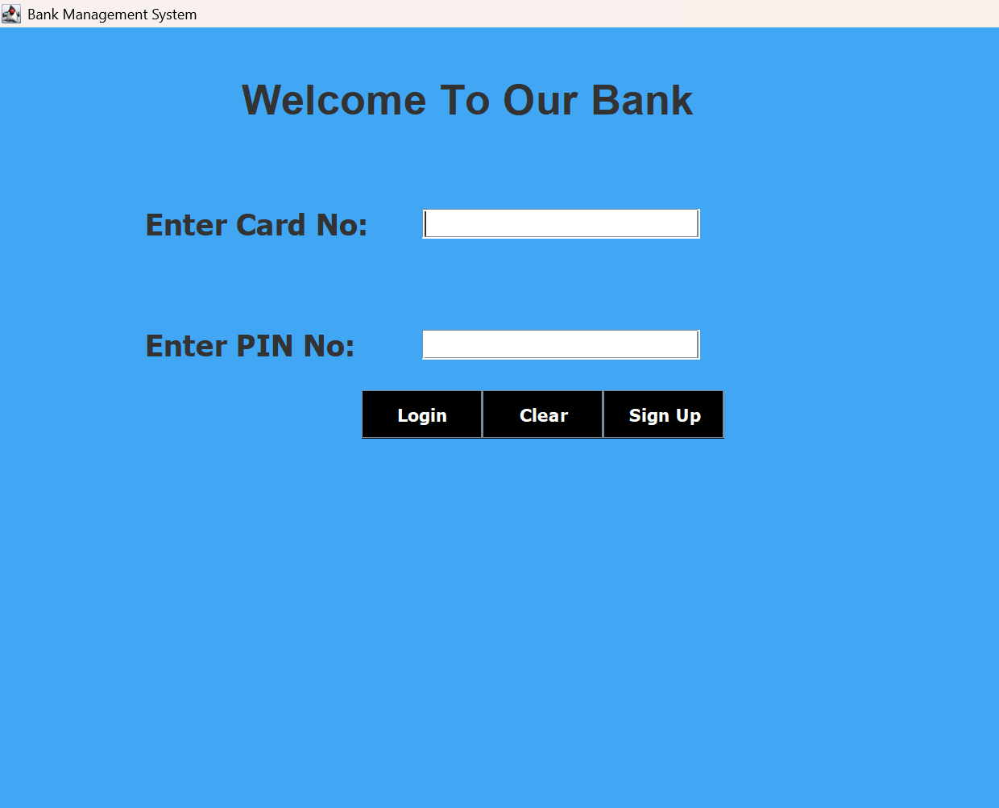
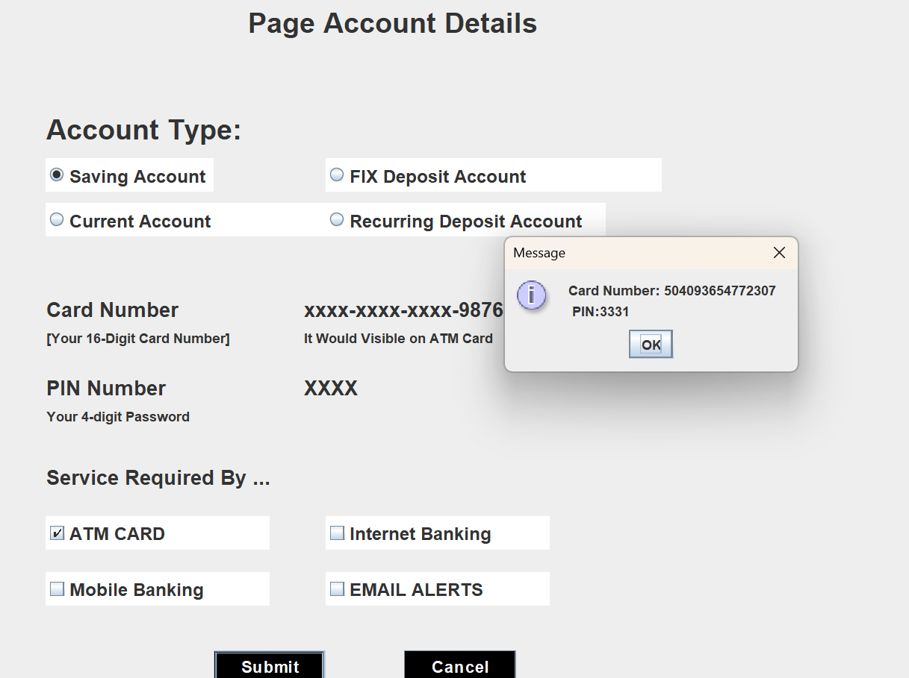
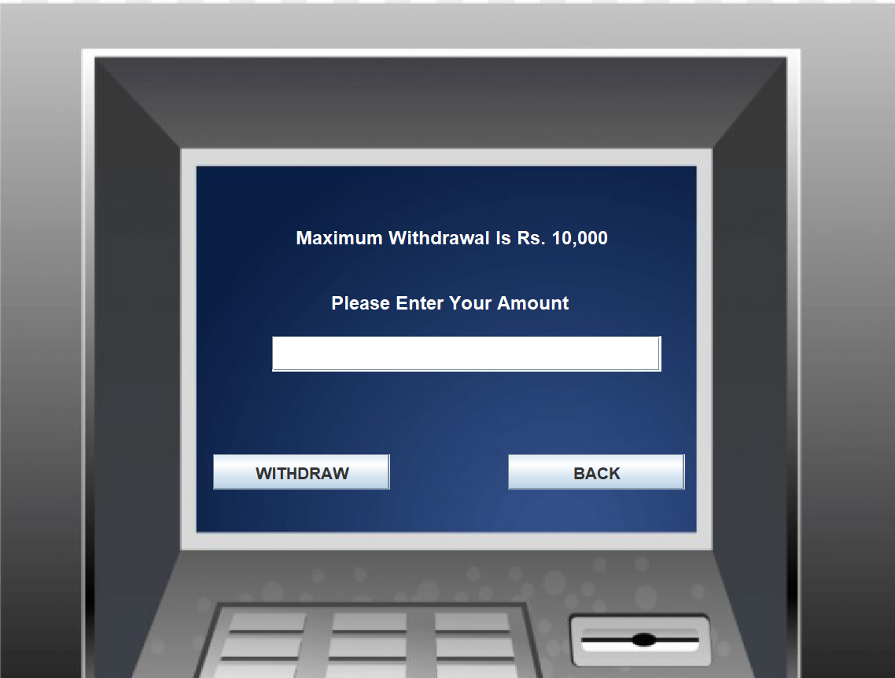
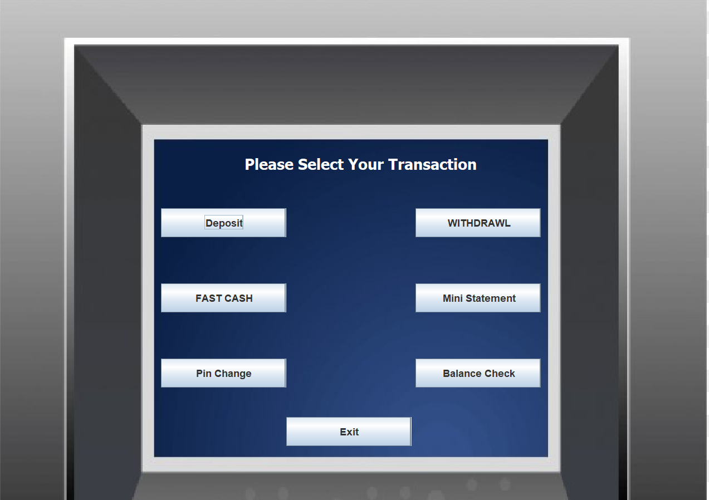

# Bank Management System 💳  

A **Java-based desktop application** that simulates basic banking operations. The system is designed using **Java Swing** for the graphical user interface (GUI) and **JDBC** for connecting with a **MySQL database**.  

This project is ideal for understanding **core Java concepts** like OOP, GUI design, event handling, and database interaction.  

---

## 🚀 Features  

- 🔐 **Login & Signup System** – Secure authentication for users  
- 💰 **Deposit & Withdraw** – Perform basic banking transactions  
- 📃 **Mini Statement** – Generate and view recent transactions  
- 🔄 **PIN Change** – Update and manage account PIN securely  
- 💳 **Balance Enquiry** – Check account balance in real-time  
- 🗄️ **Database Integration** – All data is stored and managed in **MySQL**  

---

## 🛠️ Technologies Used  

- **Java** – Core programming language  
- **Swing (Java GUI)** – User interface components  
- **JDBC** – Database connectivity  
- **MySQL** – Relational database  
- **Eclipse IDE** – Development environment  

---

## 📸 Screenshots (User Flow)  

### 1) Login  


### 2) Generate Card Number  


### 3) PIN Change  


### 4) Fast Cash  


### 5) Withdraw  


### 6) Transaction  


### 7) Balance Enquiry  


### 8) Mini Statement  


---

## ⚙️ How to Run  

1. **Clone the repository**  
2. Open the project in Eclipse ID
3. Import MySQL database
   .Create a new schema in MySQL
   .Import the provided .sql file.
4. Configure database credentials in the project (inside the JDBC connection code).
5. Run Login.java to launch the application.

### 🗄️ Database Setup  

1. **Start MySQL Server** – Make sure MySQL is installed and running on your system.  

2. **Create a New Schema** – Open MySQL and create a new database schema (e.g., `bankdb`).  
   ```sql
   CREATE DATABASE bankdb;

6. Run Login.java to launch the application.

## 🎯 Purpose  

The primary goal of this project is to provide **practical experience** in core Java development by focusing on:  

- 🖥️ **Desktop Application Development** using Java Swing  
- 🖱️ **Event Handling** (buttons, forms, user interactions)  
- 🗄️ **Database Management** through JDBC and MySQL  
- 🏦 **Banking Operations Simulation** such as login, deposit, withdrawal, balance enquiry, and mini statements  

This project serves as a **mini-project** for students and learners, and can also act as a **foundation** for building more advanced systems like:  
- 🌐 Online Banking Platforms  
- 👨‍💻 Admin Dashboards  
- 📱 Mobile Banking Applications  
